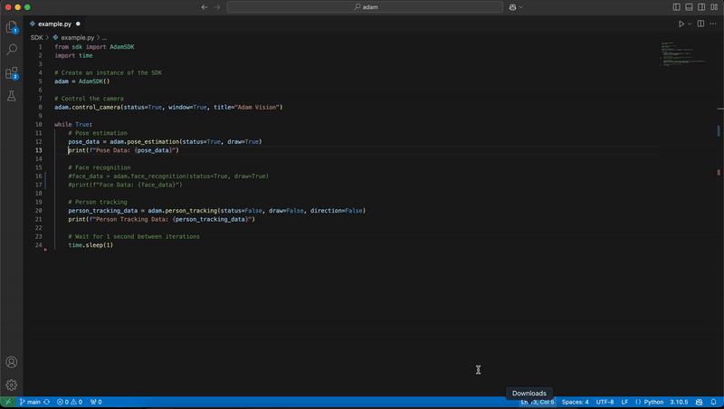

# AdamSDK - A Work in Progress 🚧

Welcome to the **AdamSDK**! 🎉 This SDK is designed to help you easily interact with various components of the Adam system 🤖. It provides control for camera 📸, vision 👁️, speech-to-text (SST) 🗣️, text-to-speech (TTS) 🔊, robot movement 🤖, sensors ⚙️, and more.

**Please note:** ⚠️ This SDK and its documentation are still under active development 🚧. We are constantly improving and expanding the features, and this README serves as a small preview 👀 of the available functionality. A complete, detailed documentation will be available in the future 📑.

## Example Code 🧑‍💻

Here is an example of how to use the **AdamSDK** to control the camera, perform pose estimation, face recognition, and track a person:

```python
from sdk import AdamSDK
import time

# Create an instance of the SDK
adam = AdamSDK()

# Control the camera
adam.control_camera(status=True, window=True, title="Adam Vision")

while True:
    # Pose estimation
    pose_data = adam.pose_estimation(status=True, draw=True)
    print(f"Pose Data: {pose_data}")

    # Face recognition
    face_data = adam.face_recognition(status=True, draw=True)
    print(f"Face Data: {face_data}")

    # Person tracking
    person_tracking_data = adam.person_tracking(status=False, draw=False, direction=True)
    print(f"Person Tracking Data: {person_tracking_data}")

    # Wait for 1 second between iterations
    time.sleep(1)
```

### Explanation of the Code:

- **`adam.control_camera(status=True, window=True, title="Adam Vision")`**: Activates the camera and shows a window with the title "Adam Vision" during development.  
  **Note**: It is recommended to disable the window in production, as it consumes resources and Adam doesn't have a screen to display it.

- **`adam.pose_estimation(status=True, draw=True)`**: Performs pose estimation and returns the detected body points with their respective names. This is useful for applications like gesture recognition or posture analysis.

- **`adam.face_recognition(status=True, draw=True)`**: Recognizes the faces of owners and returns their data. Only owners will be recognized.

- **`adam.person_tracking(status=False, draw=False, direction=True)`**: Tracks the center point of all detected people, assigns an ID, and returns the person's position.  
  If `direction=True` is set, it also indicates whether the person is to the left, right, or center relative to the center of the camera. This is helpful for applications where the robot needs to follow the user.





## Features ✨

The SDK currently offers the following functionalities:

### Camera Control 📸
- `control_camera(status=True, window=False, title="Camera Control")`: Control the camera by toggling its status 🔄, and optionally display a window with a title 🖥️.

### Vision 👁️
- `pose_estimation(status=None, draw=None)`: Perform pose estimation with optional drawing ✍️.
- `face_recognition(status=None, draw=None)`: Perform face recognition 👤 with optional drawing ✍️.
- `person_tracking(status=None, draw=None, tracking=None, direction=None)`: Track a person 👥, with options for drawing ✍️ and specifying tracking 🔍 and direction ➡️.

### Speech 🗣️
- `sst(audio_file)`: Perform speech-to-text (SST) 📝 by passing an audio file 🎧.
- `tts(text)`: Perform text-to-speech (TTS) 🔊 by passing text 📝.

### Robot Control 🤖
- `move_forward()`: Move the robot forward ⬆️.
- `move_backward()`: Move the robot backward ⬇️.
- `turn_left()`: Turn the robot left ↩️.
- `turn_right()`: Turn the robot right ↪️.

### Sensors ⚙️
- `get_temperature()`: Retrieve the temperature 🌡️ from the sensors.
- `get_gyro()`: Retrieve gyroscope data 🧭.
- `get_accelerometer()`: Retrieve accelerometer data 📐.

### Bluetooth 📶
- `list_bluetooth_devices()`: List all available Bluetooth devices 📱.
- `connect_bluetooth_device(device_id, password)`: Connect to a Bluetooth device 🔗.
- `disconnect_bluetooth_device(device_id)`: Disconnect from a Bluetooth device 🔓.

### Settings ⚙️
- `change_robot_name(new_name)`: Change the robot's name 🏷️.

### Wake Word Detection 🔊
- `listen_for_wake_word(wake_word="hey adam", audio_device="default")`: Detect a wake word 🎤 to activate the assistant 🤖.

### Chat 💬
- `chat(user_input)`: Interact with a generative chatbot 🗣️ by passing user input.

## Installation 🛠️

To use the SDK, simply clone the repository and install any dependencies:

```bash
git clone https://github.com/your-repository/adam-sdk.git
cd adam-sdk